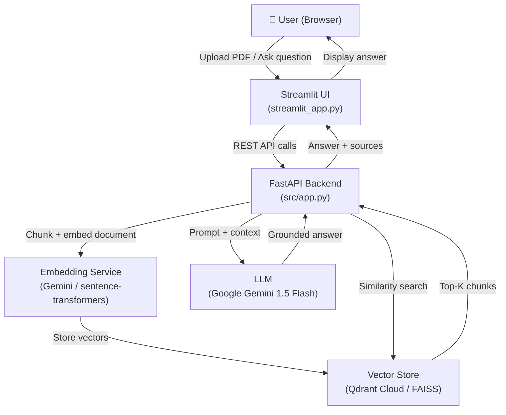

# DocQ&A — Document Question-Answering RAG Agent

> Upload PDF documents, ask questions in natural language, and get **accurate, grounded answers with source citations** — powered by Retrieval-Augmented Generation.


---

## What it does

1. **Upload** a PDF document via drag-and-drop
2. **Ask** any natural language question about it
3. **Get** a grounded AI answer with exact page references

No hallucinations — every answer is backed by retrieved text chunks from your documents.

---

## Architecture



### Key Design Decisions

| Choice | Rationale |
|---|---|
| **FastAPI** backend | Async, production-grade, auto-generates OpenAPI docs |
| **Pluggable vector store** | FAISS for local dev, Qdrant Cloud for production — same interface |
| **Pluggable embeddings** | sentence-transformers locally, Gemini API in cloud (no large model download) |
| **RAG over fine-tuning** | Documents can be updated without retraining; answers are always grounded |
| **Streamlit frontend** | Rapid UI, no JavaScript — lets the AI engineering shine |

---

## Features

| Feature | Details |
|---|---|
| 📄 PDF ingestion | Automatic text extraction, chunking with configurable overlap |
| 🔍 Semantic search | Vector similarity search over embedded document chunks |
| 💡 Grounded answers | Every answer cites source document + page number |
| 🎯 Document filtering | Query all documents or a specific one |
| 🔁 Duplicate detection | Smart re-upload with replace option |
| 💬 Conversation history | Full session tracking with confidence scores |
| 🔧 Health monitoring | Real-time component status in the UI sidebar |
| 🐳 Docker ready | Multi-stage Dockerfile, `docker compose up` for full local stack |
| ☁️ Cloud Run ready | Deploy to GCP with `gcloud builds submit` |

---

## Quick Start (Local)

### Prerequisites
- Python 3.11+
- [uv](https://github.com/astral-sh/uv) (`pip install uv`)
- A [Google Gemini API key](https://aistudio.google.com/)

### 1. Clone & install

```bash
git clone https://github.com/your-username/docqa.git
cd docqa
uv venv && .venv\Scripts\activate   # Windows
uv pip install -e .
```

### 2. Configure

```bash
cp .env.example .env
# Edit .env and set GEMINI_API_KEY=your_key_here
```

### 3. Start

```bash
# Terminal 1 — FastAPI backend
python -m uvicorn src.app:app --reload

# Terminal 2 — Streamlit UI
streamlit run streamlit_app.py
```

Open **http://localhost:8501** — upload a PDF and start asking questions.

---

## Docker (Full local stack with Qdrant)

```bash
# Copy and fill in your API key
cp .env.example .env

# Start Qdrant + FastAPI backend
docker compose up

# Then in a separate terminal:
API_BASE_URL=http://localhost:8080 streamlit run streamlit_app.py
```

---

## Cloud Deployment (Google Cloud Run)

> Deploys a fully stateless backend using **Gemini embeddings** (no local model) and **Qdrant Cloud** (free tier).

### 1. Set up Qdrant Cloud

Sign up at [cloud.qdrant.io](https://cloud.qdrant.io) and create a free cluster.
Copy the cluster URL and API key.

### 2. Configure GCP

```bash
gcloud auth login
gcloud config set project YOUR_PROJECT_ID
gcloud services enable cloudbuild.googleapis.com run.googleapis.com
```

### 3. Deploy

```bash
gcloud builds submit --config cloudbuild.yaml .
```

### 4. Set secrets in Cloud Run

In the GCP console, add these env vars to your Cloud Run service:
- `GEMINI_API_KEY`
- `QDRANT_URL`
- `QDRANT_API_KEY`

### 5. Point Streamlit at the deployed backend

On [Streamlit Community Cloud](https://streamlit.io/cloud), set the secret:
```
API_BASE_URL = https://docqa-backend-xxxx-uc.a.run.app
```

---

## Project Structure

```
docqa/
├── src/
│   ├── app.py                 # FastAPI endpoints
│   ├── config.py              # Config (env-variable driven)
│   ├── ingestion.py           # PDF → chunks pipeline
│   ├── embeddings.py          # Embedding provider abstraction
│   ├── interfaces.py          # VectorStore abstract interface
│   ├── vector_store.py        # FAISS implementation
│   ├── qdrant_vector_store.py # Qdrant implementation
│   ├── query_engine.py        # Retrieval + ranking
│   ├── answer_generator.py    # LLM prompt + generation
│   └── ui_utils.py            # Streamlit API client
├── tests/                     # pytest test suite
├── demo/
│   └── DEMO_QUESTIONS.md      # Sample questions for demos
├── streamlit_app.py           # Streamlit frontend
├── Dockerfile                 # Multi-stage production image
├── docker-compose.yml         # Local full-stack (Qdrant + backend)
├── cloudbuild.yaml            # GCP Cloud Run CI/CD
└── .env.example               # Config template (LOCAL + CLOUD sections)
```

---

## Running Tests

```bash
pytest tests/ -v
```

---

## Demo Guide

See [`demo/DEMO_QUESTIONS.md`](demo/DEMO_QUESTIONS.md) for a tiered set of demo
questions (factual retrieval → synthesis → edge cases) with tips on what to
highlight for each.

---

## Requirements

- Python 3.11+
- Google Gemini API key
- *(Cloud)* Qdrant Cloud free tier account
- *(CI/CD)* Google Cloud project with Cloud Build + Cloud Run APIs enabled